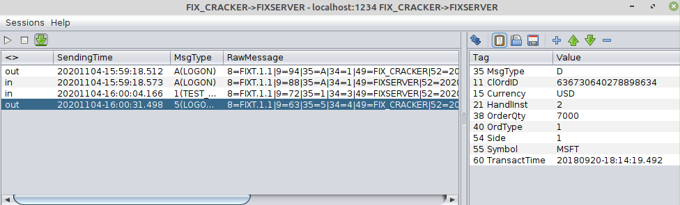

markdown synFIX Cracker is a lightweight UI tool built on QuickFIXJ base  

Main features:
* Configurable list of sessions for future use
* Composing of custom FIX messages to send
* Convenient view of sent and received FIX messages

